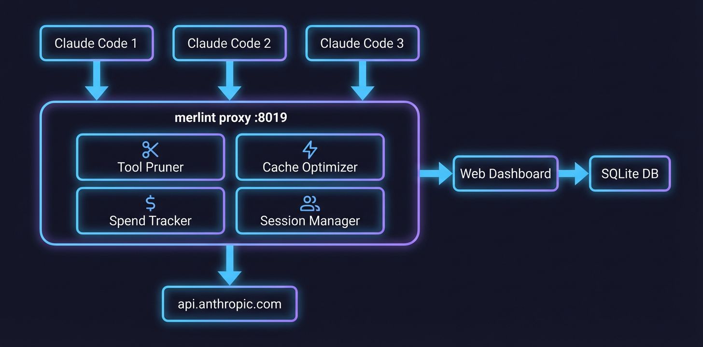

<p align="center">
  
</p>

<h1 align="center">merlint</h1>

<p align="center">
  <strong>LLM Agent Token Optimizer</strong><br>
  Diagnose. Optimize. Monitor. Repeat.
</p>

<p align="center">
  <a href="https://crates.io/crates/merlint"></a>
  <a href="https://github.com/Link817290/Merlint/blob/main/LICENSE"></a>
  <a href="https://github.com/Link817290/Merlint/actions"></a>
</p>

---

A transparent proxy that sits between your coding agent and the LLM API, automatically reducing token waste, improving cache hit rates, and tracking spend — with zero config changes to your agent.

```
Claude Code (window 1)  ──┐
Claude Code (window 2)  ──┼──>  merlint proxy :8019  ──>  api.anthropic.com
Claude Code (window 3)  ──┘
                                │
                                ├─ Prune unused tools (~200 tok/tool/req)
                                ├─ Stable tool ordering for cache hits
                                ├─ Per-project session tracking
                                ├─ Spend logging & budget enforcement
                                └─ Live web dashboard
```

## Installation

**macOS / Linux (one-line install + auto-proxy):**

```bash
curl -fsSL https://raw.githubusercontent.com/Link817290/Merlint/main/install.sh | bash
```

After install, merlint proxy starts automatically on every terminal launch. Claude Code requests are optimized transparently — **no extra config needed.**

**Windows (PowerShell):**

```powershell
irm https://raw.githubusercontent.com/Link817290/Merlint/main/install.ps1 | iex
```

**From source (requires Rust):**

```bash
cargo install --git https://github.com/Link817290/Merlint.git
```

**Binary downloads:** See [Releases](https://github.com/Link817290/Merlint/releases).

## Quick Start

After install, the proxy runs automatically. Use these commands anytime:

```bash
# Check proxy status
merlint-status

# Analyze latest session
merlint latest

# Scan all local agent sessions
merlint scan

# Auto-optimize (generate CLAUDE.md + tool whitelist)
merlint optimize

# View spend report
merlint spend --days 7

# View waste pattern insights
merlint spend --insights
```

Proxy control:

```bash
merlint-stop      # Stop proxy
merlint-start     # Restart proxy
```

## Architecture

<p align="center">
  
</p>

## Features

### Real-time Proxy Optimization

Transparent HTTP proxy that intercepts LLM API calls and optimizes them on the fly:

- **Tool pruning** — Removes unused tool definitions, saving ~200 tokens per tool per request
- **Stable tool ordering** — Sorts tools alphabetically after pruning to maximize Anthropic prompt cache prefix hits
- **Cache-aware suspension** — Automatically pauses pruning when cache hit rate is high (avoids breaking a good cache)
- **Per-project warm-start** — Loads tool usage history from spend.db so pruning works from request #1
- **System message merging** — Merges duplicate system prompt fragments
- **File read dedup** — Deduplicates consecutive identical file reads
- **SSE streaming passthrough** — Forwards streaming responses chunk-by-chunk with zero added latency
- **Multi-session tracking** — Auto-identifies different agent windows by project, tracks independently

```bash
# Custom start (usually not needed — install script configures this)
merlint proxy --target https://api.anthropic.com --optimize --port 8019
```

Supports both OpenAI and Anthropic API formats with auto-detection.

### Spend Tracking & Budget Control

SQLite-based spend logging with per-session and per-model breakdowns:

```bash
# Last 7 days spend report
merlint spend --days 7

# Waste pattern analysis
merlint spend --insights
```

Set budget limits via environment variables:

```bash
export MERLINT_DAILY_LIMIT=5.00     # $5/day hard cap
export MERLINT_SESSION_LIMIT=2.00   # $2/session cap
```

Exceeding limits returns HTTP 429 to the agent, preventing runaway costs.

### Diagnostics

Analyze agent session token usage and find waste:

- **Token stats** — Prompt / completion / total per API call
- **Cache analysis** — Prefix stability, hit rate, theoretical optimum
- **Efficiency checks** — Loop detection, repeated file reads, useless retries
- **Tool utilization** — Defined vs. used vs. never-used tools

```bash
merlint analyze --source session.jsonl --format claude-code
```

### Auto-Optimization

Generate optimized configs based on diagnostic results:

- **Prune tools** — Remove unused tool definitions
- **Optimize prompts** — Restructure system prompts for better caching
- **Generate configs** — Auto-generate `CLAUDE.md` and `.merlint-tools.json`

```bash
merlint optimize --source session.jsonl
```

### Live Dashboard

Web dashboard at `http://localhost:8019/merlint/dashboard` showing:

- Total requests, active sessions, tokens saved, estimated cost savings
- Per-session details with project path, cache hit rate, pruning status
- Event log (new sessions, optimization actions)
- Request log (status, latency, tokens saved per request)
- Auto-refreshes every 2 seconds

### Waste Pattern Detection

`merlint spend --insights` detects three waste patterns:

| Pattern | Trigger | Meaning |
|---------|---------|---------|
| Repeated Reads | >10 reads, >2x ratio | Agent re-reads the same files excessively |
| Bloated Context | >100k prompt tokens in >3 reqs | Context window is oversized |
| Expensive Model | opus/gpt-4 with <100 output tokens | Powerful model used for trivial tasks |

## Multi-Session Tracking

merlint automatically identifies different agent windows/projects:

- Derives session key from `Primary working directory` in system prompt
- Each project gets independent token stats and optimizer state
- Also supports explicit `X-Merlint-Session` header
- Dashboard shows project path instead of opaque hash

No config needed — open multiple windows, sessions auto-separate.

## Supported Formats

| Format | Description | Auto-detect |
|--------|-------------|-------------|
| `merlint` | Native JSON format | Yes |
| `claude-code` | Claude Code JSONL sessions | Yes |
| `codex` | Codex CLI JSON sessions | Yes |

merlint auto-detects file format — `--format` is usually not needed.

## Report Example

```
═══════════════════════════════════════════
          Merlint Report
═══════════════════════════════════════════

▸ Overview
  API Calls:    12
  Total Tokens: 156.2K
  ├─ Prompt:     142.8K
  └─ Completion: 13.4K

▸ Cache (API data)
  Cache Read:     98.2K (68.8% of prompt)
  Hit Rate:       [█████████████░░░░░░░] 69%

▸ Tool Efficiency
  Defined: 23    Used: 8    Unused: 15
  ⚠ 65% of defined tools never used

▸ Efficiency
  ⚠ 'src/main.rs' read 4 times
  ✗ Loop: 'Bash' called 5 times consecutively
```

## Command Reference

| Command | Description |
|---------|-------------|
| `merlint up` | Quick start: launch proxy with defaults (port 8019, Anthropic, optimize) |
| `merlint down` | Stop the proxy started by `merlint up` |
| `merlint proxy` | Start transparent optimization proxy (advanced options) |
| `merlint dashboard` | Live terminal dashboard showing proxy status and session stats |
| `merlint scan` | Scan local agent session files |
| `merlint latest` | Analyze most recent session |
| `merlint analyze` | Analyze a specific session file |
| `merlint optimize` | Generate and apply optimizations |
| `merlint monitor` | Continuous monitoring + auto-optimize |
| `merlint query` | Query specific metrics |
| `merlint spend` | View spend reports and insights |
| `merlint report` | Show usage report with trends over time |
| `merlint profile` | Show your agent usage profile and habits |
| `merlint daemon` | Run as background daemon: periodic scan + summarize |
| `merlint setup-shell` | Install shell hook for auto ANTHROPIC_BASE_URL config |
| `merlint-status` | Check proxy status |
| `merlint-start` | Start proxy |
| `merlint-stop` | Stop proxy |

## License

[MIT](LICENSE)
